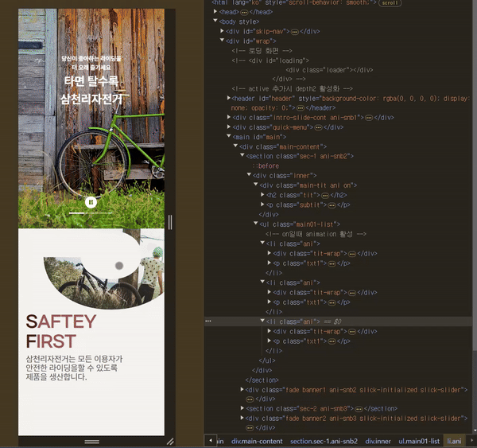

# GSAP으로 하는 스크롤 트리거 특정 태그 지정

## 0. 배경

레퍼런스 사이트를 지정하여 오래된 웹사이트를 리메이크 해보는 프로젝트 도중, 좋은 코드를 발견하게 되었다.

[레퍼런스 사이트 주소](https://www.gccorp.com/kor/index)

> GC녹십자 : https://www.gccorp.com/kor/index

```javascript
//javascript
// 메인 타이틀 ani
$('.ani').each(function (index, item) {
    ScrollTrigger.create({
        trigger: item,
        start: 'top 65%',
        end: '+=9999',
        once: true,
        toggleClass: {
            targets: item,
            className: 'on',
        },
        // markers: true,
    });
});
```

위 코드의 사용 목적은 사용자가 사이트를 보는 영역이 되었을 때, 해당영역에 애니메이션을 불러오기 위해서이다.

효율적이고 쉬운 방법으로 스크롤 트리거를 통한 애니메이션 적용 방법을 찾게 된 것 같아, 잊어버리기 전에 정리하고자 한다.

---

## 1. 원리

우선, 사용해보기 위해 코드 이해부터가 필요하였다.

레퍼런스 사이트의 코드 첫번째 줄(가장 바깥쪽)부터 차근차근 이해해보았다.

```javascript
$('.ani').each(function (index, item) {});
```

jquery로 작성되었다. 그런데 매개변수 index를 넣는다는게 이해가 잘 가지 않기도 하고, jquery는 예전 방법이라는 생각이 들었다. 그래서 바닐라 js 개념으로 한번 chatgpt를 통해 바꾼뒤 이해해 보았다.

```javascript
document.querySelectorAll('.ani').forEach(function (item) {취할 행동});
```

querySelector라는 익숙한 메서드가 나왔다. class, id 등을 지정하기 위한 대표적인 js 방법(메서드)이다.

> querySelector는 지정된 선택자와 일치하는 첫 번째 요소만 반환한다.

뜻을 해석해보자면, class에 ani를 지니고 있는 모든 태그(querySelectorAll)에 대하여 각각(forEach)에 "function () {취할 행동}" 를 적용하겠다는 것이다. 소괄호 안에 item은 이 함수(function)의 매개변수로서, ".ani"을 item이라는 매개변수로 받겠다는 것이다. 함수의 매개변수 임으로, item말고 다른 이름으로 지정해도 상관없는 부분이겠다.

그 다음, 함수 안쪽의 내용, {취할 행동}을 이해해보았다.

```javascript
{
    ScrollTrigger.create({
        trigger: item,
        start: 'top 65%',
        end: '+=9999',
        once: true,
        toggleClass: {
            targets: item,
            className: 'on',
        },
        // markers: true,
    });
}
```

ScrollTrigger에 create라는 메서드가 있는지 이번에 처음 알게 되었다. create안에 속성값 중에 toggleClass라는게 보일 것이다. 이 속성에서 target을 item(이 경우에는 .ani 클래스)으로 잡고, 'on'이라는 클래스를 target 태그(item)에 추가(create)를 하겠다는 것이다.

> 이해가 한 번에 안가서 유사한 걸 다시 보면서 이해해 보기도 하였다.

```javascript
// 유사한 jquery의 addClass 메서드
$('.all-menu').click(function () {
    $('#nav-all').addClass('active');
});

// 유사한 바닐라 js의 classList.add 메서드
div.classList.add('on');
```

나머지 부분은 수업시간에 배운 gsap scrolltrigger 방법이 유사해서 익숙하였다.

```javascript
        trigger: item,
        start: 'top 65%',
        end: '+=9999',
        once: true,
```

start는 해당 태그 영역의 가장 윗 부분(top)이, 화면뷰의 65%를 만났을 떄(가장 위가 0%, 가장 아래가 100%이다) 해당 효과가 시작하는 지점을 지정하는 속성이다.

end는 말그대로 끝나는 지점을 정하는 것 이고, 나는 해당 애니메이션이 유지 되었으면 해서, +=9999를 유지하였다.

once: true는 그냥 한번만 애니메이션이 실행되라는 속성으로 이해하고 넘어갔다.

> 그렇게 해서 완성된 js 코드

```javascript
document.querySelectorAll('.ani').forEach(function (item) {
    ScrollTrigger.create({
        trigger: item,
        start: 'top 65%',
        end: '+=9999',
        once: true,
        toggleClass: {
            targets: item,
            className: 'on',
        },
        markers: false,
    });
});
```

## 2. 응용

> 예시 1

앞서 완성된 js코드를 놔두고, 이제 응용을 해보았다.

우선, class명이 main01-list인 ul 태그 밑에 있는 li들에 대하여, 'class: ani'를 부여하였다.

html 구조는 이러하다.

> ani라는 class 부여된 태그가 애니메이션 시작을 일으킴과 동시에 끝도 될 수 있는 것이므로, 애니메이션이 일어나는 요소들의 부모 태그를 잘 지정해 부여하는 것이 핵심이었다.

```html
<li class="ani">
    <div class="tit-wrap">
        <p class="num num1">1</p>
        <p class="title title1">Forever <br />Together</p>
        <div class="img-wrap">
            
        </div>
    </div>
    <p class="txt1">
        할아버지와 아버지의 유년 시절에도, 지금 우리의 일상에서도
        <br />
        삼천리자전거는 여러분의 든든한 두 발이 되어 소중한 순간들을 만들어나갑니다.
    </p>
</li>
```

> css는 이렇게 적었다. 애니메이션 before 코드에 transition을 적용하는게 핵심이다.

```css
/* 애니메이션 전 */
.num {
    font-size: 7rem;
    opacity: 0;
    transition: all 0.3s;
    @include tabletMore {
        font-size: 18rem;
        margin-bottom: -42px;
    }
    color: $primary-80;
    margin-bottom: -17px;
}

.title1 {
    opacity: 0;
    transition: all 0.3s;
}

.txt1 {
    margin-top: 11px;
    font-size: 1.8rem;
    opacity: 0;
    transition: all 0.3s ease 1s;
    @include tabletMore {
        font-size: 2.2rem;
    }
}
```

```css
/* 애니메이션 후 */
.ani {
    &.on {
        .num,
        .title1,
        .txt1 {
            opacity: 1;
        }
        .bike-oj-1 {
            transform: translate(-50%, 8%);
            @include mobileMore {
                transform: translate(-50%, 2%);
            }
            @include tabletMore {
                transform: translate(-50%, 13%);
            }
        }
    }
}
```

스크롤이 내려가면서 해당 li태그의 가장 위에 마진이 트리거가 되어 start되면서 li 태그 안에 있는 태그들이 애니메이션으로 나오게 하였다. 그 결과 이렇게 나왔다.



## 2. 기타 - 내가 시도했던 잘못된 방법들 (나중에 정리할 예정)

처음에 이 코드가 이해가 가지 않아서 다른 방법으로 애니메이션을 구현하고자 하였다.

### (1) 윈도우 스크롤 값에 따라 애니메이션 나오게 한 방법

### (2) gsap timeline 플러그인과 from 메서드를 통한 스크롤 트리거 방법
